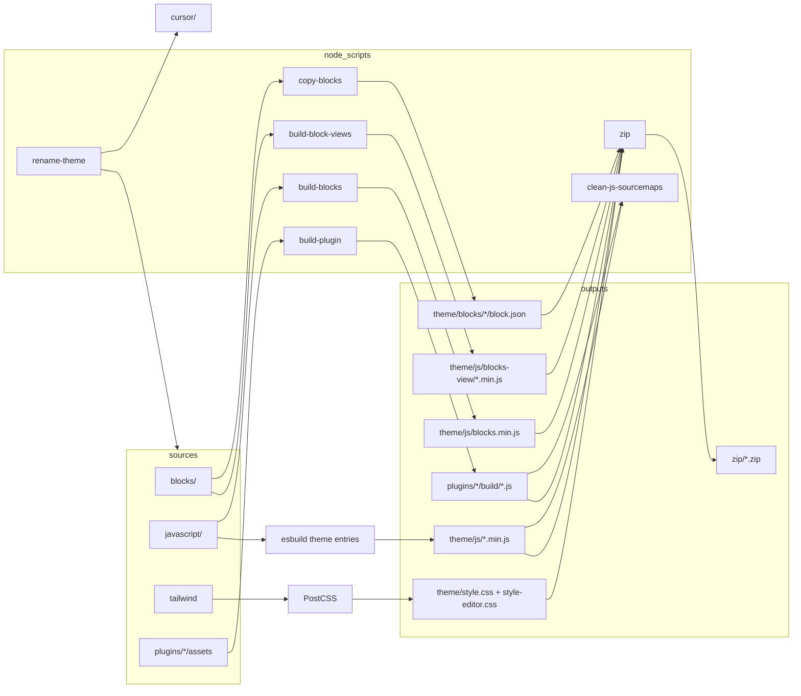

# Boilerplate Theme — development guide

Technical reference for the asset pipeline, block system, and Node scripts.

**Workflow commands** (daily development, production, linting, rename, WordPress linking): see [`../README.md`](../README.md).  
**Environment setup and clone instructions:** see [`../../README.md`](../../README.md).

## 1. Overview

**Purpose:** Ship a cohesive WordPress site experience: a custom block theme plus plugins that share design tokens (Tailwind-generated CSS) and isolated frontend/admin scripts where needed.

**Key ideas:**

- **Dual-path blocks:** Authoritative block _metadata_ is synced into `theme/blocks/` for WordPress; editor code is bundled separately; optional **view** bundles load only when the block is present on the page.
- **Global `@wordpress/*` in bundles:** Editor and plugin builds use `esbuild-plugin-external-global` so npm imports resolve to `window.wp.*` (and `window.jQuery` where configured) instead of duplicating packages.
- **Boilerplate placeholders:** Use `rename-theme.js` and `rename-plugin.js` before starting a real project (workflow in [`../README.md`](../README.md#rename-theme-placeholders)).

## 2. Architecture (high level)



## 3. Script API and behaviour

### 3.1 `node_scripts/copy-blocks.js`

**What it does:** Copies `blocks/<name>/block.json` → `theme/blocks/<name>/block.json` for every subdirectory of `blocks/` that contains `block.json`.

**Parameters:** None.

**Exit codes:** Exits `1` if `blocks/` is missing; otherwise completes after logging copied/warned blocks.

**Edge cases:**

- Directories under `blocks/` without `block.json` are skipped with a warning.
- Directories starting with `_` are ignored.
- Creates `theme/blocks/<name>/` when missing.
- Only `block.json` is copied — PHP block classes stay in `theme/src/`; frontend markup stays in `theme/views/blocks/*.twig`.

### 3.2 `node_scripts/build-blocks.js`

**What it does:** Bundles `javascript/blocks.js` to `theme/js/blocks.min.js` (IIFE, JSX loader, `externalGlobalPlugin` for WordPress and React globals).

**Parameters:** `--minify` (production), `--watch` (esbuild context watch).

**Extension point:** If a new block imports an `@wordpress/*` package not yet listed, add it to `wpGlobals` in this file or the build will fail or bundle incorrectly.

### 3.3 `node_scripts/build-block-views.js`

**What it does:** Discovers `blocks/<slug>/view.js` automatically and builds each file to `theme/js/blocks-view/<slug>.min.js`.

**Parameters:** `--minify`, `--watch`.

**Edge cases:**

- If no `view.js` files exist, the script exits successfully with a skip message.
- Adding `blocks/my-block/view.js` is enough — no manual entry list is required.
- Reference the built script from `block.json` (e.g. via `viewScript` handle registered in PHP).

### 3.4 `node_scripts/build-plugin.js`

**Usage:** `node node_scripts/build-plugin.js <plugin-name> [--watch] [--minify]`

**What it does:** If `assets/admin/js/dashboard.js` and/or `assets/frontend/js/frontend.js` exist under `plugins/<plugin-name>/`, bundles them to `plugins/<plugin-name>/build/` with WordPress/jQuery globals.

**Exit codes:** `1` if plugin name missing or plugin directory missing; `0` with a skip message if no entry files exist.

**Called by:** `node_scripts/run-plugin-builds.js` (see [§3.10](#310-node_scriptsrun-plugin-buildsjs)). Dev, watch, and production npm scripts no longer name a plugin slug. Pass the directory name when calling this file directly:

```bash
node node_scripts/build-plugin.js boilerplate-plugin
node node_scripts/build-plugin.js boilerplate-plugin --minify
```

### 3.5 `node_scripts/rename-theme.js`

**Usage:** `node node_scripts/rename-theme.js [<slug>] [--company <company>] [--dry-run]`

Slug and company are required. Omit `<slug>` when `THEME_SLUG` or `THEME_SYNC_SLUG` is set, and omit `--company` when `THEME_COMPANY` is set. Precedence for the slug: positional `<slug>`, then `THEME_SLUG`, then `THEME_SYNC_SLUG`. Precedence for the company: `--company`, then `THEME_COMPANY`. The process environment is checked before `.env.local` and `.env`. A CLI value overrides the environment.

**What it does:** Replaces boilerplate placeholders in this package, in `cursor/` at the repository root, and in `.vscode/settings.json` (`phpsab.standard`). That setting is `boilerplate-theme/phpcs.xml` when the repository root is the workspace; the `boilerplate-theme` segment becomes the new slug. Directories under `cursor/skills/` whose names contain `boilerplate-theme` are renamed to the new slug (for example `boilerplate-theme-create-block` becomes `<slug>-create-block`).

**Replacements:**

| Placeholder | Example for `sw-soltau` + `--company SmartMedia24` |
| ----------- | -------------------------------------------------- |
| `boilerplate-theme` | `sw-soltau` |
| `boilerplate_theme` | `sw_soltau` |
| `CompanyName` | `SmartMedia24` |
| `companyname` | `smartmedia24` |
| `https://companyname.example` | `https://smartmedia24.example` |
| `BoilerplateTheme` | `Swsoltau` (full namespace: `SmartMedia24\Swsoltau`) |
| `Boilerplate Theme` | `Sw Soltau` |
| `BOILERPLATE_THEME_` | `SWSOLTAU_` |
| `boilerplate/example-block` | `sw-soltau/example-block` |

**Edge cases:**

- Slug must match `^[a-z0-9]+(?:-[a-z0-9]+)*$`.
- Company must be kebab-case (e.g. `smart-media-24`) or PascalCase (e.g. `SmartMedia24`).
- Slug and company are required via CLI or environment. A CLI value overrides `THEME_SLUG`, `THEME_SYNC_SLUG`, and `THEME_COMPANY`.
- Renames directories under `cursor/skills/` whose names contain `boilerplate-theme`. Other folders, including the package directory, are not renamed.
- Scans `.php`, `.json`, `.js`, `.css`, `.md`, `.mdc`, and `.twig` files, plus `.env.example` (the sync example is not a scanned extension, so it is included explicitly, same idea as `.vscode/settings.json`).
- Skips `vendor/`, `vendor-prefixed/`, `build/`, and `zip/` (important after Strauss: never rewrite prefixed dependencies).
- Rewrites the Local theme-sync slug in `sync-theme.example.json` (`slug`), `.env.example` (commented `THEME_SLUG` / `THEME_SYNC_SLUG` / `THEME_SYNC_TARGET` and `THEME_COMPANY`), and the default in `node_scripts/sync-theme.js`. Does not edit `.env`, `.env.local`, or `sync-theme.local.json`. Those local values win when set.
- Rewrites `theme/composer.json` (`namespace_prefix`, `classmap_prefix`, PSR-4) and prefixed `use` lines, but leaves an existing `theme/vendor-prefixed/` on the old prefix. Run `composer install --working-dir=theme` afterwards (or `pnpm run composer:install:dev` once all rename scripts have finished) so Strauss and `bin/fix-prefixed-twig.php` rebuild it.

### 3.6 `node_scripts/rename-plugin.js`

**Usage:** `node node_scripts/rename-plugin.js <slug> --company <company> [--plugin <plugin-dir>] [--old-slug <placeholder-slug>] [--namespace <Namespace>] [--dry-run]`

**What it does:** Replaces plugin-specific placeholders (including company), renames `plugins/<plugin>/` to `plugins/<slug>/`, renames the bootstrap PHP file and main plugin class file.

Calling the script **without arguments** (or without required parameters) exits with an error listing what is missing and prints the full usage.

Run **`rename-theme.js` first** (company + theme), then **`rename-plugin.js`**.

**Parameters:**

| Argument | Meaning | Default |
| -------- | ------- | ------- |
| `<slug>` | New plugin slug / text domain | (required) |
| `--company` | Company (kebab-case or PascalCase) | (required) |
| `--plugin` | Plugin folder under `plugins/` | = `--old-slug` |
| `--old-slug` | Placeholder slug in file contents | `boilerplate-plugin` |
| `--namespace` | PHP namespace / main class segment | derived from `<slug>` |
| `--dry-run` | Preview only | off |

**Examples:**

```bash
# Settings API alternative
node node_scripts/rename-plugin.js mvg-aktuell \
  --plugin boilerplate-plugin \
  --old-slug boilerplate-plugin \
  --company SmartMedia24 \
  --namespace MvgAktuell

# SCF Framework alternative (folder differs from content placeholders)
node node_scripts/rename-plugin.js mvg-aktuell \
  --plugin scf-boilerplate-plugin \
  --old-slug boilerplate-plugin \
  --company SmartMedia24 \
  --namespace MvgAktuell
```

**Replacements** (FROM `--old-slug` / company placeholders → new values):

| Placeholder | Example for `mvg-aktuell` + `SmartMedia24` |
| ----------- | ------------------------------------------ |
| `boilerplate-plugin` | `mvg-aktuell` |
| `boilerplate_plugin` | `mvg_aktuell` |
| `BoilerplatePlugin` | `MvgAktuell` (or `--namespace`) |
| `Boilerplate Plugin` | `Mvg Aktuell` |
| `BOILERPLATE_PLUGIN_` | `MVGAKTUELL_` |
| `CompanyName` | `SmartMedia24` |
| `companyname` | `smartmedia24` |

Also updates the `--plugin` directory name in root references (`package.json`, docs, …) as a whole token. Renaming `boilerplate-plugin` leaves `scf-boilerplate-plugin` intact in Composer, zip, and sourcemap script names. The commented `PLUGIN_SLUGS` example in `.env.example` is updated one comma-separated field at a time. `.env` and `.env.local` are not edited, and `.env.example` is not part of the substring replacement used for plugin files.

After renaming, run `composer install --working-dir=plugins/<slug>` to regenerate Strauss `vendor-prefixed/`. If `rename-theme.js` ran as well, regenerate the theme in the same pass with `pnpm run composer:install:dev` (theme Timber prefix plus both plugins).

### 3.7 `node_scripts/clean-js-sourcemaps.js`

**Usage:** `node node_scripts/clean-js-sourcemaps.js [<plugin-name>]`

**What it does:** Recursively deletes `*.map` files from `theme/js/` (no argument) or from `plugins/<plugin-name>/build/`.

**Parameters:** Optional plugin slug (e.g. `boilerplate-plugin`).

**When to run:** Automatically invoked by `pnpm run production` after asset and Composer production installs.

### 3.8 `node_scripts/zip.js`

**Usage:** `node node_scripts/zip.js <theme|plugin> <slug>`

**What it does:** Creates a deployable ZIP under `zip/<slug>.zip`. For themes, archives `theme/` with the slug as the root folder name inside the archive (e.g. `boilerplate-theme/`). For plugins, archives `plugins/<slug>/`. The archive includes `vendor-prefixed/` when that directory exists. `zip:theme` does not run Composer; `pnpm run bundle` runs the production Composer installs first.

**Theme version injection:** After creating a theme ZIP, writes a base36 Unix timestamp into `BOILERPLATE_THEME_VERSION` inside `src/Theme/ThemeManager.php` so asset cache busting uses the build time.

**Examples:**

```bash
node node_scripts/zip.js theme boilerplate-theme
node node_scripts/zip.js plugin boilerplate-plugin
```

### 3.9 `node_scripts/sync-theme.js`

**Usage:** `node node_scripts/sync-theme.js [--watch] [--dry-run] [--optional] [--target=<path>] [--wp-content=<path>] [--slug=<slug>]`

**What it does:** Copies the contents of `theme/` into a Local WP theme directory so `style.css` lands at `<destination>/style.css`. npm scripts: `sync:theme` (full copy), `development` (full copy once after the asset build, `--optional`), `watch:sync:theme` (initial copy, then changed files only; started by `pnpm run watch`).

**Destination:** `--target` is that folder. Otherwise `<WP_CONTENT_PATH>/themes/<slug>`. Slug order: `--slug`, `THEME_SLUG`, `THEME_SYNC_SLUG`, `sync-theme.local.json`, `sync-theme.example.json` (default `boilerplate-theme`), then the constant in this script. Process environment is checked for both slug keys before dotenv files. A full `THEME_SYNC_TARGET` is used only when no wp-content path is set. `--slug` with only a full target replaces the last folder name. `.env` overrides the example. `rename-theme.js` updates the example and the script default, not `.env`.

**Excluded:** `node_modules/`, `.git/`, `vendor/` (unprefixed Composer), `*.map`, `.DS_Store`, `Thumbs.db`. **Included:** PHP, Twig, `style.css`, `style-editor.css`, built JS, block metadata, and `vendor-prefixed/`.

**Exit codes:** `1` when the destination is missing (unless `--optional`, which prints a skip line and exits `0`), the path is a Windows drive path, or the target is the repo or a parent such as `themes/` or `wp-content/`. `--watch` keeps the process running after the initial sync.

**Edge cases:**

- Refuses to create a mistyped `wp-content` path; the directory must already exist. The theme folder under `themes/` is created.
- Repeat runs skip files with the same size and mtime. A full sync also deletes destination files that were removed from `theme/`.
- `--dry-run` prints the plan and does not start the watcher.
- Plugin sync is `node_scripts/sync-plugin.js` ([§3.11](#311-node_scriptssync-pluginjs)).

### 3.10 `node_scripts/run-plugin-builds.js`

**Usage:** `node node_scripts/run-plugin-builds.js [--watch] [--minify] [--slug=<slug>]`

**What it does:** Reads `PLUGIN_SLUGS` and runs `build-plugin.js` once per slug. No flag is the dev build, `--watch` keeps one esbuild process open per slug, and `--minify` is the production build used by `production:esbuild:plugins`.

**Slug order:** `--slug`, otherwise `PLUGIN_SLUGS` from the process environment, then `.env.local`, then `.env`. `#` comments and blank values are ignored. An empty list exits 0. There is no default plugin. `--slug` builds that directory even when it is missing from the list.

**npm scripts:**

```bash
pnpm run development:plugins --slug=scf-boilerplate-plugin
pnpm run watch:plugins
pnpm run production:esbuild:plugins
```

`development:**` includes `development:plugins`. `watch:**` includes `watch:plugins`. `production:esbuild*` includes `production:esbuild:plugins`, so `production:assets` minifies only the listed slugs. An empty list makes the watch process exit 0; `run-p` keeps the theme watchers running.

### 3.11 `node_scripts/sync-plugin.js`

**Usage:** `node node_scripts/sync-plugin.js [--watch] [--dry-run] [--optional] [--slug=<slug>]`

**What it does:** Copies the contents of each `plugins/<slug>/` into `<WP_CONTENT_PATH>/plugins/<slug>/`. The bootstrap file lands directly in that folder. `build/` is included once the plugin build has written it. npm scripts:

```bash
pnpm run sync:plugin --slug=scf-boilerplate-plugin
pnpm run sync:plugins --optional
pnpm run watch:sync:plugins
```

`watch:sync:plugins` is `pnpm run sync:plugins --watch --optional`. `pnpm run development` syncs the theme, then the plugins. `pnpm run watch` starts `watch:sync:plugins` with the theme watcher.

**Slug order:** same as `run-plugin-builds.js`. An empty list exits 0 with or without `--optional`.

**Destination:** `<WP_CONTENT_PATH>/plugins/<slug>/`. `wp-content` must already exist; the plugin directory is created. A missing `plugins/<slug>/` source, a Windows drive path, or a destination inside the repository or equal to `plugins/` or `wp-content/` exits 1.

**Excluded:** `node_modules/`, `.git/`, `vendor/` (unprefixed Composer), `*.map`, `.DS_Store`, `Thumbs.db`. **Included:** PHP, views, built JS, and `vendor-prefixed/`. The directory filter matches the name `vendor` only, so `vendor-prefixed/` is copied.

**Exit codes:** `0` when `PLUGIN_SLUGS` is empty. `0` with `--optional` when the list is set and `WP_CONTENT_PATH` is missing. `1` in that case without `--optional`. `1` for a missing source, a Windows path, or an unsafe destination.

**Edge cases:**

- Repeat runs skip files with the same size and mtime. A full sync deletes destination files that were removed from the plugin source.
- `--watch` does one full copy, then copies only changed files, with one watcher per slug.
- `--dry-run` prints the plan and does not start the watcher.
- The SCF plugin directory is `scf-boilerplate-plugin`. Its bootstrap file remains `boilerplate-plugin.php`. The slug is the folder name.

## 4. Tailwind and CSS

- Entry: `tailwind.css` with PostCSS (Tailwind 4, nesting, imports).
- `_TW_TARGET` selects editor vs frontend output (`development:tailwind:editor`, optional intellisense file).
- `_TW_ENV=production` enables production-oriented CSS processing via npm scripts.
- Component-level styling for blocks lives under `tailwind/custom/components/` using `@apply`.

Build commands: [`../README.md` §Development workflow](../README.md#development-workflow).

## 5. Composer, Strauss, and runtime dependencies

Runtime Composer packages are **prefixed with [Strauss](https://github.com/BrianHenryIE/strauss)** so theme and plugins can ship isolated dependencies without autoloader conflicts. Install commands and the production workflow are documented in [`../README.md`](../README.md#composer-and-strauss).

- Strauss PHAR: `bin/strauss.phar` (gitignored; fetched by `bin/download-strauss.php` on first run)
- Downloader uses PHP cURL, then `file_get_contents` as fallback, and rejects a body that is too small to be a real PHAR
- Prefixed output: `vendor-prefixed/` (gitignored, generated on `composer install`)
- Bootstrap loads `vendor-prefixed/autoload.php` (includes project PSR-4 via `include_root_autoload`)
- `require-dev` packages (e.g. `symfony/var-dumper`) are **not** prefixed
- Theme runtime dependency: `timber/timber` (`^2.0`) in `theme/composer.json` `require` and `extra.strauss.packages`. Prefixed to `CompanyName\BoilerplateTheme\Timber\…` and `CompanyName\BoilerplateTheme\Twig\…` (placeholders until `rename-theme.js`)
- `update_call_sites: true` rewrites PHP only in the autoload directory (`theme/src/`, plugin `includes/`). Root templates and `theme/inc/` keep hand-written prefixed imports: `use CompanyName\BoilerplateTheme\Timber\Timber;`
- Theme `prefix-namespaces` runs `bin/fix-prefixed-twig.php` after `strauss.phar`. Strauss does not rewrite class names inside Twig code-generation strings (`use Twig\Template;`). Without that script every Twig render fatals with `Class "Twig\Template" not found`. The dry-run script and the plugin `prefix-namespaces` scripts do not run it.
- `delete_vendor_packages: true` deletes the unprefixed package from `vendor/` after copying. Rebuild with `composer install` in that package. `prefix-namespaces` alone does not download the packages again.
- `functions.php` admin notice when `vendor-prefixed/autoload.php` is missing; `ThemeManager` admin notice when the prefixed `Timber` class is missing. Frontend templates still call Timber and fatal in both cases.

**Adding a runtime dependency (plugin example):**

1. Add the package to `"require"` in `plugins/boilerplate-plugin/composer.json`
2. List it in `"extra"."strauss"."packages"` (or leave empty to prefix all `require` entries)
3. Run `composer prefix-namespaces:dry-run --working-dir=plugins/boilerplate-plugin`
4. Run `composer update --working-dir=plugins/boilerplate-plugin`
5. Use normal `use Vendor\Class` imports in plugin code under `includes/`; Strauss rewrites those call sites on install. Files outside the autoload directory (theme root templates, `theme/inc/`) are not rewritten and must import the prefixed class.

The plugin includes a **Strauss demo** on Settings → Boilerplate Plugin (`ramsey/uuid`).

## 6. Best practices and pitfalls

See [`../README.md` §Best practices](../README.md#best-practices) and [`../README.md` §Common pitfalls](../README.md#common-pitfalls).

## 7. Related documentation

- [`../README.md`](../README.md) — package structure, rename workflow, pnpm/Composer commands, local WordPress usage
- [`../../README.md`](../../README.md) — boilerplate overview, WSL development, sync into Local WP (`is_readable()` is false for UNC and WSL symlinks)
- [`../../cursor/skills/boilerplate-theme-create-block/SKILL.md`](../../cursor/skills/boilerplate-theme-create-block/SKILL.md) — block scaffolding checklist
