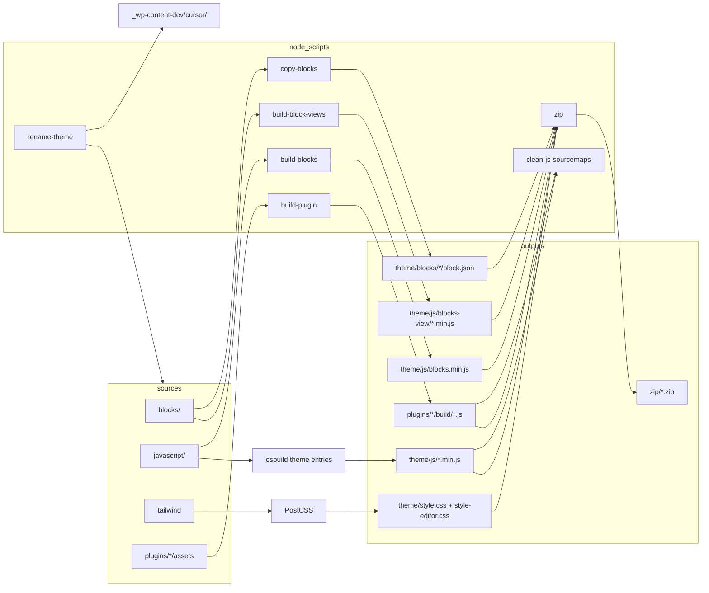

# Boilerplate Theme — development guide

This document describes how the asset pipeline and block system fit together, how the Node scripts behave, and what to watch for when extending the project.

For project setup, renaming placeholders, and WordPress linking, see [`../README.md`](../README.md) and [`../../README-boilerplates.md`](../../README-boilerplates.md).

## 1. Overview

**Purpose:** Ship a cohesive WordPress site experience: a custom block theme plus plugins that share design tokens (Tailwind-generated CSS) and isolated frontend/admin scripts where needed.

**Key ideas:**

- **Dual-path blocks:** Authoritative block _metadata_ is synced into `theme/blocks/` for WordPress; editor code is bundled separately; optional **view** bundles load only when the block is present on the page.
- **Global `@wordpress/*` in bundles:** Editor and plugin builds use `esbuild-plugin-external-global` so npm imports resolve to `window.wp.*` (and `window.jQuery` where configured) instead of duplicating packages.
- **Boilerplate placeholders:** Use `rename-theme.js` to replace `boilerplate-theme`, `BoilerplateTheme`, and related tokens before starting a real project.

## 2. Architecture (high level)



## 3. Script API and behaviour

### 3.1 `node_scripts/copy-blocks.js`

**What it does:** Copies `blocks/<name>/block.json` → `theme/blocks/<name>/block.json` for every subdirectory of `blocks/` that contains `block.json`.

**Parameters:** None.

**Exit codes:** Exits `1` if `blocks/` is missing; otherwise completes after logging copied/warned blocks.

**Edge cases:**

- Directories under `blocks/` without `block.json` are skipped with a warning.
- Directories starting with `_` are ignored.
- Creates `theme/blocks/<name>/` when missing.
- Only `block.json` is copied — PHP templates and classes stay in `theme/`.

### 3.2 `node_scripts/build-blocks.js`

**What it does:** Bundles `javascript/blocks.js` to `theme/js/blocks.min.js` (IIFE, JSX loader, `externalGlobalPlugin` for WordPress and React globals).

**Parameters:** `--minify` (production), `--watch` (esbuild context watch).

**Extension point:** If a new block imports an `@wordpress/*` package not yet listed, add it to `wpGlobals` in this file or the build will fail or bundle incorrectly.

### 3.3 `node_scripts/build-block-views.js`

**What it does:** Discovers `blocks/<slug>/view.js` automatically and builds each file to `theme/js/blocks-view/<slug>.min.js`.

**Parameters:** `--minify`, `--watch`.

**Edge cases:**

- If no `view.js` files exist, the script exits successfully with a skip message.
- Adding `blocks/my-block/view.js` is enough — no manual entry list is required.
- Reference the built script from `block.json` (e.g. via `viewScript` handle registered in PHP).

### 3.4 `node_scripts/build-plugin.js`

**Usage:** `node node_scripts/build-plugin.js <plugin-name> [--watch] [--minify]`

**What it does:** If `assets/admin/js/dashboard.js` and/or `assets/frontend/js/frontend.js` exist under `plugins/<plugin-name>/`, bundles them to `plugins/<plugin-name>/build/` with WordPress/jQuery globals.

**Exit codes:** `1` if plugin name missing or plugin directory missing; `0` with a skip message if no entry files exist.

**Example (included boilerplate plugin):**

```bash
node node_scripts/build-plugin.js boilerplate-plugin
node node_scripts/build-plugin.js boilerplate-plugin --minify
```

### 3.5 `node_scripts/rename-theme.js`

**Usage:** `node node_scripts/rename-theme.js <slug> --company <company> [--dry-run]`

**What it does:** Replaces boilerplate placeholders in this package and in `_wp-content-dev/cursor/`.

**Replacements:**

| Placeholder | Example for `sw-soltau` + `--company SmartMedia24` |
| ----------- | -------------------------------------------------- |
| `boilerplate-theme` | `sw-soltau` |
| `boilerplate_theme` | `sw_soltau` |
| `CompanyName` | `SmartMedia24` |
| `companyname` | `smartmedia24` |
| `https://companyname.example` | `https://smartmedia24.example` |
| `BoilerplateTheme` | `Swsoltau` (full namespace: `SmartMedia24\Swsoltau`) |
| `Boilerplate Theme` | `Sw Soltau` |
| `BOILERPLATE_THEME_` | `SWSOLTAU_` |
| `boilerplate/example-block` | `sw-soltau/example-block` |

**Edge cases:**

- Slug must match `^[a-z0-9]+(?:-[a-z0-9]+)*$`.
- Company must be kebab-case (e.g. `smart-media-24`) or PascalCase (e.g. `SmartMedia24`).
- `--company` is required.
- Only file contents are updated; folders are not renamed.
- Scans `.php`, `.json`, `.js`, `.css`, `.md`, and `.mdc` files.
- Skips `vendor/`, `vendor-prefixed/`, `build/`, and `zip/` (important after Strauss: never rewrite prefixed dependencies).

### 3.6 `node_scripts/rename-plugin.js`

**Usage:** `node node_scripts/rename-plugin.js <slug> [--old-slug boilerplate-plugin] [--dry-run]`

**What it does:** Replaces plugin-specific placeholders, renames `plugins/<old-slug>/` to `plugins/<slug>/`, renames the bootstrap PHP file and main plugin class file.

Run **`rename-theme.js` first** (company + theme), then **`rename-plugin.js`** (plugin slug/namespace).

**Replacements:**

| Placeholder | Example for `mvg-aktuell` |
| ----------- | ------------------------- |
| `boilerplate-plugin` | `mvg-aktuell` |
| `boilerplate_plugin` | `mvg_aktuell` |
| `BoilerplatePlugin` | `MvgAktuell` |
| `Boilerplate Plugin` | `Mvg Aktuell` |
| `BOILERPLATE_PLUGIN_` | `MVGAKTUELL_` |

Also updates root references in `package.json`, `composer.json`, `phpcs.xml`, `rector.php`, and docs.

After renaming, run `composer install --working-dir=plugins/<slug>` to regenerate Strauss `vendor-prefixed/`.

### 3.7 `node_scripts/clean-js-sourcemaps.js`

**Usage:** `node node_scripts/clean-js-sourcemaps.js [<plugin-name>]`

**What it does:** Recursively deletes `*.map` files from `theme/js/` (no argument) or from `plugins/<plugin-name>/build/`.

**Parameters:** Optional plugin slug (e.g. `boilerplate-plugin`).

**When to run:** Automatically invoked by `pnpm run production` after asset and Composer production installs.

### 3.7 `node_scripts/zip.js`

**Usage:** `node node_scripts/zip.js <theme|plugin> <slug>`

**What it does:** Creates a deployable ZIP under `zip/<slug>.zip`. For themes, archives `theme/` with the slug as the root folder name inside the archive (e.g. `boilerplate-theme/`). For plugins, archives `plugins/<slug>/`.

**Theme version injection:** After creating a theme ZIP, writes a base36 Unix timestamp into `BOILERPLATE_THEME_VERSION` inside `src/Theme/ThemeManager.php` so asset cache busting uses the build time.

**Examples:**

```bash
node node_scripts/zip.js theme boilerplate-theme
node node_scripts/zip.js plugin boilerplate-plugin
```

## 4. Tailwind and CSS

- Entry: `tailwind.css` with PostCSS (Tailwind 4, nesting, imports).
- `_TW_TARGET` selects editor vs frontend output (`development:tailwind:editor`, optional intellisense file).
- `_TW_ENV=production` enables production-oriented CSS processing via npm scripts.
- Component-level styling for blocks lives under `tailwind/custom/components/` using `@apply`.

## 5. npm scripts

Individual tasks are defined in `package.json`. Common examples:

### 5.1 CSS

```bash
pnpm run development:tailwind:frontend
pnpm run development:tailwind:editor
pnpm run production:tailwind:frontend
```

### 5.2 Theme JavaScript

```bash
pnpm run development:esbuild
pnpm run development:esbuild:blocks
pnpm run development:esbuild:block-views
pnpm run production:esbuild
pnpm run production:esbuild:blocks
pnpm run production:esbuild:block-views
```

### 5.3 Blocks metadata sync

```bash
pnpm run development:copy-blocks
```

Run this after any `block.json` change before testing in WordPress.

### 5.4 Plugin JavaScript

```bash
pnpm run development:esbuild:plugin:boilerplate-plugin
pnpm run production:esbuild:plugin:boilerplate-plugin
```

### 5.5 Linting

PHP linting runs from the package root via Composer (not from theme or plugin directories):

```bash
composer install
composer php:lint
composer php:lint:autofix
composer php:rector              # dry-run
composer php:rector:fix:lint     # apply Rector, WPCS autofix, then WPCS check (recommended)
# or individually:
composer php:rector:fix
composer php:lint:autofix
composer php:lint
composer make-pot:theme
composer make-pot:plugin
```

JavaScript/CSS:

```bash
pnpm run lint
pnpm run lint-fix
```

### 5.6 Development and watch

Build all development assets in parallel:

```bash
pnpm run development
pnpm run dev          # alias
pnpm run watch        # watch mode for CSS, JS, blocks, and plugin assets
```

### 5.7 Production and release

Full production pipeline (minified assets, production Composer installs, sourcemap cleanup):

```bash
pnpm run production
pnpm run prod         # alias
```

Create deployable ZIP archives (theme + plugins):

```bash
pnpm run zip:theme
pnpm run zip:plugin:boilerplate-plugin
pnpm run zip          # theme + all plugin ZIPs
```

Production build plus ZIP creation in one step:

```bash
pnpm run bundle
```

Output lands in `zip/` (gitignored). After `rename-theme.js`, the `zip:theme` script slug is updated automatically via the `boilerplate-theme` placeholder.

Install Composer dependencies for local development:

```bash
pnpm run composer:install:dev
pnpm run composer-dev   # alias
```

### 5.8 Composer dependencies and Strauss (theme + plugins)

Runtime Composer packages are **prefixed with [Strauss](https://github.com/BrianHenryIE/strauss)** so theme and plugins can ship isolated dependencies without autoloader conflicts.

- Strauss PHAR: `bin/strauss.phar` (downloaded automatically on first run, gitignored)
- Prefixed output: `vendor-prefixed/` (gitignored, generated on `composer install`)
- Bootstrap loads `vendor-prefixed/autoload.php` (includes project PSR-4 via `include_root_autoload`)
- `require-dev` packages (e.g. `symfony/var-dumper`) are **not** prefixed

```bash
# Install all Composer roots (root PHPCS tools, theme, plugins)
pnpm run composer:install:dev

# Plugin only
composer install --working-dir=plugins/boilerplate-plugin

# Preview prefixing without writing files
composer prefix-namespaces:dry-run --working-dir=plugins/boilerplate-plugin

# Run Strauss manually after config changes
composer prefix-namespaces --working-dir=plugins/boilerplate-plugin
```

**Adding a runtime dependency (plugin example):**

1. Add the package to `"require"` in `plugins/boilerplate-plugin/composer.json`
2. List it in `"extra"."strauss"."packages"` (or leave empty to prefix all `require` entries)
3. Run `composer prefix-namespaces:dry-run --working-dir=plugins/boilerplate-plugin`
4. Run `composer update --working-dir=plugins/boilerplate-plugin`
5. Use normal `use Vendor\Class` imports in plugin code; Strauss rewrites call sites on install

The plugin includes a **Strauss demo** on Settings → Boilerplate Plugin (`ramsey/uuid`).

## 6. Best practices

- Run **`development:copy-blocks`** after any `block.json` change so `theme/blocks/` stays in sync before testing in WordPress.
- Keep **`name` in `block.json` stable**; renaming breaks existing post content. Use deprecations for markup migrations.
- Use **`apiVersion`: 3** for new blocks (iframe editor compatibility).
- For dynamic blocks, implement PHP `render` and keep `save` minimal (`null` or inner blocks content only).
- Align **`editorScript`** with the theme's registered handle (`boilerplate-theme-blocks-editor`); avoid raw file paths in `block.json` where the theme expects a handle.
- Run **`rename-theme.js`** then **`rename-plugin.js`** before copying `_wp-content-dev/cursor/` to `.cursor/` when starting a new project.

## 7. Common pitfalls

| Pitfall | Symptom | Mitigation |
| ------- | ------- | ---------- |
| Forgot `copy-blocks` after `block.json` edit | WordPress loads stale metadata | Run `development:copy-blocks` |
| New `@wordpress/*` import in blocks bundle | Resolve/bundle errors | Extend `wpGlobals` in `build-blocks.js` |
| Expecting full block folder under `theme/blocks/` | Only `block.json` is copied | Keep PHP/templates in `theme/`; bundle JS via `javascript/` and `blocks/` |
| `view.js` present but not enqueued | Missing frontend behaviour | Register/enqueue handle in PHP; reference in `block.json` |
| Plugin script empty in WordPress | `build/` missing or outdated | Run `build-plugin.js` for that plugin |
| Renamed project but Cursor rules unchanged | AI uses old `boilerplate-theme` paths | Run `rename-theme.js` (includes `_wp-content-dev/cursor/`) |

## 8. Related documentation

- [`../README.md`](../README.md) — package structure, rename workflow, local WordPress usage
- [`../../README-boilerplates.md`](../../README-boilerplates.md) — boilerplate overview, setup order, PowerShell helpers
- [`../../cursor/skills/boilerplate-theme-create-block/SKILL.md`](../../cursor/skills/boilerplate-theme-create-block/SKILL.md) — block scaffolding checklist
